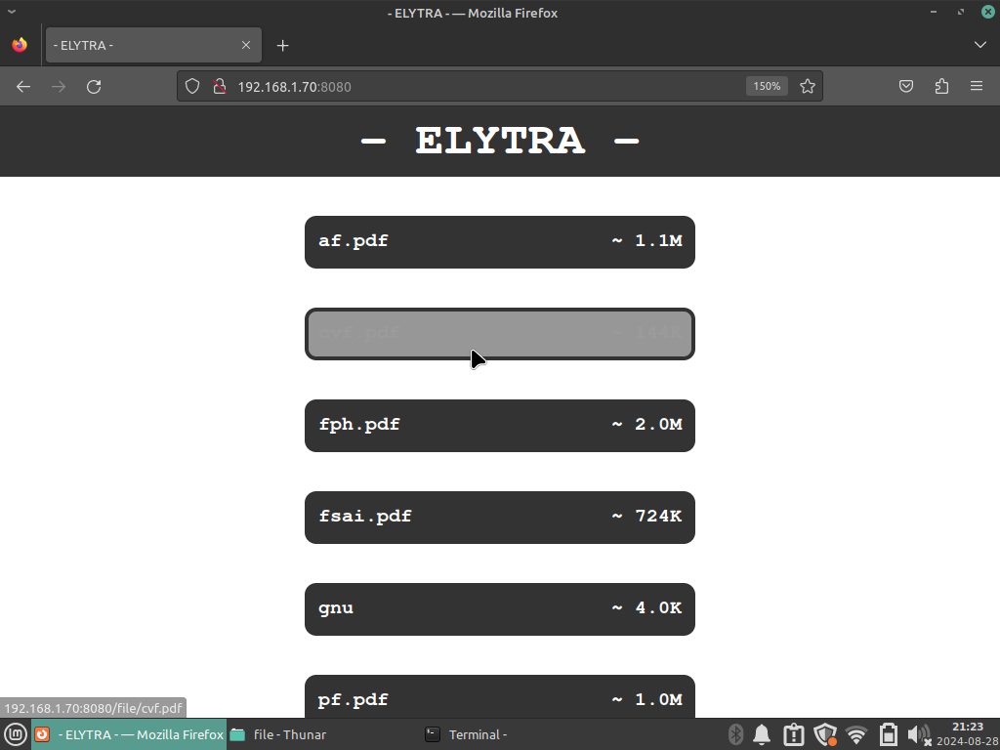

### ELYTRA

- Versatile, quick set-up file server over local Wi-Fi network
- Automatic HTML generation for each file's download button

1. Install Dependencies:
```bash
$ sudo apt install lighttpd
```

2. Put your files in file elytra/site/file, then:
```bash
$ chmod 755 run.sh
$ ./run
```

3. Ctrl-C to terminate gracefully

Web interface screenshot:


PS: you can edit and add new configs in ./elytra/makeconf/
